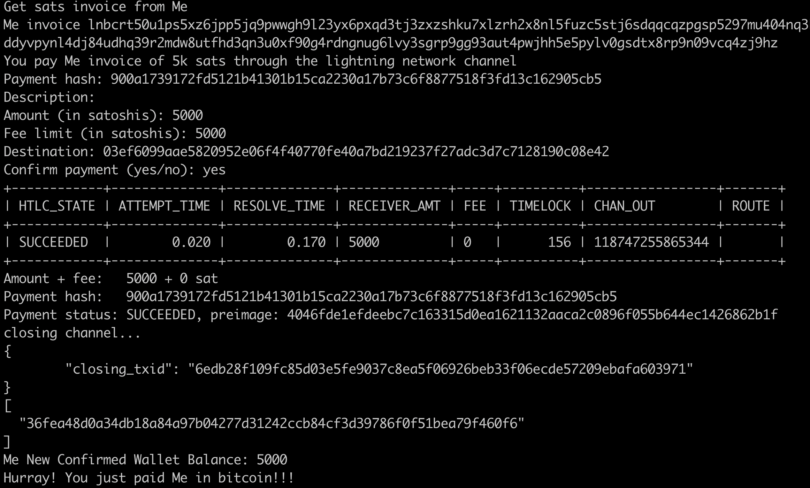

# paymeinbitcoin
Pay-me-in-bitcoin using Bitcoin Lightning Network

**Programmed in Shell and Docker**

# How it works --> Local Testing: 10 steps to pay me in bitcoin with hops = 0, fees = 0
```
1. Create a test block-chain --> 2. Mine Bitcoin block --> 3. Send coins to Lightning Node(Source) --> 4. Source lightning node(You) connect to Destination node(Me) --> 5. Open a Lightning channel --> 6. On-chain Funding Transaction confirmation --> 7. Destination node(Me) creates payment invoice request --> 8. Source(You) pay invoice amount --> 9. close channel --> 10. on-chain closing transaction confirmation

```
### 1:1 mapping :: steps : line of code
```
There is 1:1 mapping of all the 10 steps above with the actual line of code in paymeinbitcoin.sh script.
```
# How to use

### Install - Docker, Docker compose, jq
```
git clone https://github.com/govivek/paymeinbitcoin.git

cd paymeinbitcoin

docker-compose build

docker-compose up

New terminal tab

chmod +x paymeinbitcoin.sh

./paymeinbitcoin.sh

confirm payment (yes/no) : yes

On successful payment, the last line of logs should be -

Hurray! You just paid Me in bitcoin!!!

```


